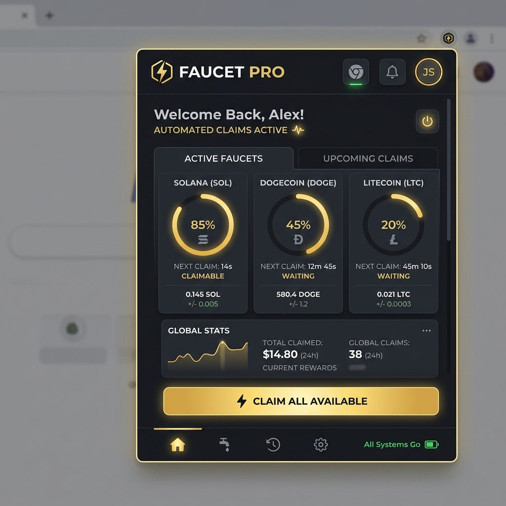

# 🚀 Astra Yield Protocol v2.3
### The Premier Multi-Chain Yield Optimization Protocol

**Astra Yield Protocol** (formerly Faucet Pro) is a professional-grade browser extension designed for high-efficiency, multi-account yield automation. Built for the modern crypto ecosystem, it provides a seamless, "set-and-forget" experience for maximizing automated claims across multiple networks.

---

## 💎 Elite Performance Features

### 🛡️ Alpha Heuristics & Anti-Detection
Maximize your account longevity with our proprietary **Alpha Heuristics** engine. 
- **Smart Timing Logic**: Mimics human behavior with randomized claim intervals.
- **Extended "Long Breaks"**: Configurable 65-80 minute rest periods to avoid pattern detection.
- **Native Click Emulation**: Uses the Chrome DevTools Protocol for trusted, hardware-level interaction.

### 🌐 Multi-Chain Support
One protocol to rule them all. Unified support for the most profitable networks:
- **LTC** (Litepick) | **DOGE** (Dogepick) | **SOL** (Solpick) | **BNB** (Bnbpick) | **TRON** (Tronpick) | **POL/MATIC** (Polpick)

### 🛰️ Cluster-Aware Management
Designed for professional "Node" operators.
- **Node Identity Branding**: Unique ID tagging for every instance in your cluster.
- **Real-Time Telegram Alerts**: Instant reporting of successful yields, withdrawals, and system status directly to your Telegram bot.

---

## 🛠️ Unified Command Center

### Core Capabilities:
- **Intelligent Auto-Withdrawal**: Automatically move profits to your cold wallet once custom USD thresholds are met.
- **Automated CAPTCHA Solving**: Integrated support for modern anti-bot challenges (Turnstile, hCaptcha).
- **Yield Forecasting**: Real-time CoinGecko API integration for live USD balance tracking.
- **BETA: High-Roller Dice Strategy**: Automated risk-management for internal site games to multiply your yields.

---

## 🚀 Rapid Deployment

1.  **Clone / Download** this repository.
2.  Open `chrome://extensions` in your browser.
3.  Enable **Developer mode** and click **Load unpacked**.
4.  Launch the **Astra Yield Wizard** to configure your protocol in 3 easy steps.

---

## ⚖️ Disclaimer
*Astra Yield Protocol is designed for educational and research purposes. Use of automated tools may violate the terms of service of certain platforms. The developers are not responsible for any account suspensions or losses.*

---

**© 2026 Astra Yield Labs. Professional Yield Optimization.**
