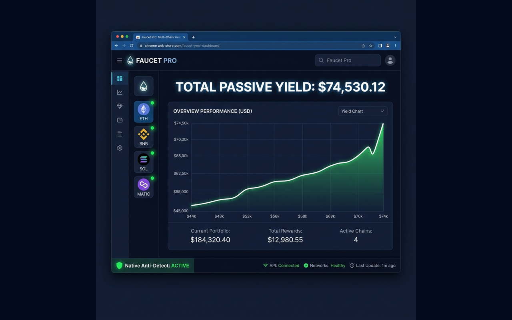
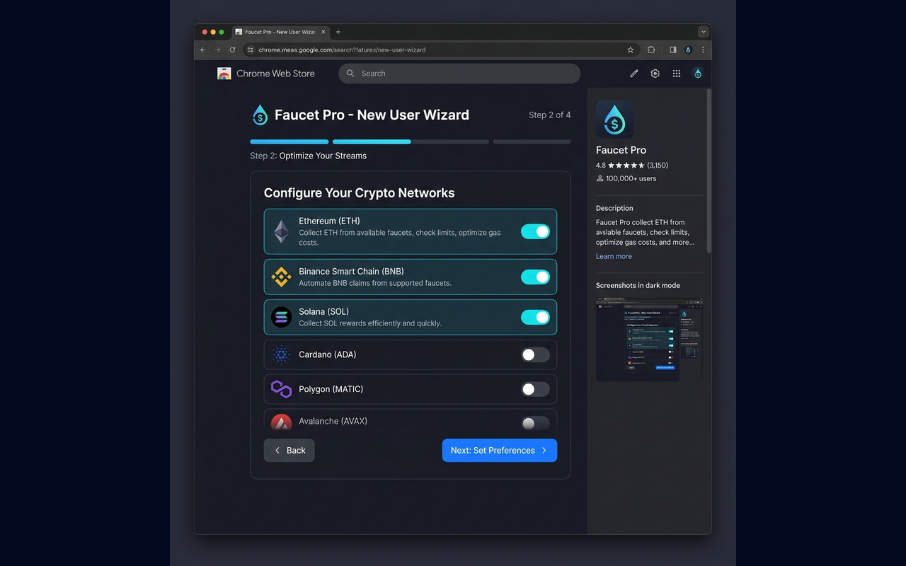

# 🚰 Faucet Pro v2.6.0
### The Gold Standard in Faucet Automation

**Faucet Pro** is a premium, professional-grade browser extension designed to automate your favorite cryptocurrency faucets with a single click. Experience a clean, secure, and highly efficient "set-and-forget" workflow crafted for the modern user.

---

## ✨ Key Features

### 🤖 Smart Automation
*   **Set & Forget**: Once configured, our intelligent engine monitors and claims from your selected sites autonomously.
*   **Human-Like Behavior**: Advanced anti-detection algorithms with randomized delays and "Long Breaks" (65-80 minutes) protect your accounts.
*   **Native Interaction**: Uses deep browser integration to simulate real user behavior, bypassing common bot detection.

### 🌐 Supported Platforms
Automate claims across the industry's most popular faucet networks:
*   **Litepick** (LTC)
*   **Dogepick** (DOGE)
*   **Solpick** (SOL)
*   **Bnbpick** (BNB)
*   **Tronpick** (TRX)
*   **Polpick** (POL/MATIC)

### 💰 Professional Tools
*   **Auto-Withdrawal**: Securely transfer your earnings to your wallet automatically upon reaching your custom threshold.
*   **Telegram Yield Alerts**: Stay informed with real-time notifications sent directly to your phone for every successful claim and withdrawal.
*   **Live Balance Tracking**: Monitor your portfolio value in USD with real-time price feeds.
*   **Premium Dashboard**: A beautiful, glassmorphic interface that provides a clear overview of your automation status.

---

## 🚀 Getting Started in Seconds

1.  **Install** the Faucet Pro extension.
2.  **Launch the Setup Wizard** to configure your favorite sites and wallet addresses in 3 simple steps.
3.  **Click "Start Automation"** and let the bot handle the rest.

---

## 🛡️ Safety & Privacy
*   **100% Local**: All settings and sensitive data are stored exclusively on your machine. We have zero access to your information.
*   **Military-Grade Encryption**: Local data is encrypted to ensure your site credentials remain secure.
*   **Transparency**: No hidden trackers, no data collection, just pure automation.

---

## ⚖️ Disclaimer
*Faucet Pro is intended for personal automation and research purposes. Please ensure you comply with the terms of service of the sites you use. The developers are not responsible for account-related issues or financial losses.*

---

**© 2026 Faucet Pro Labs. Precision. Security. Automation.**

